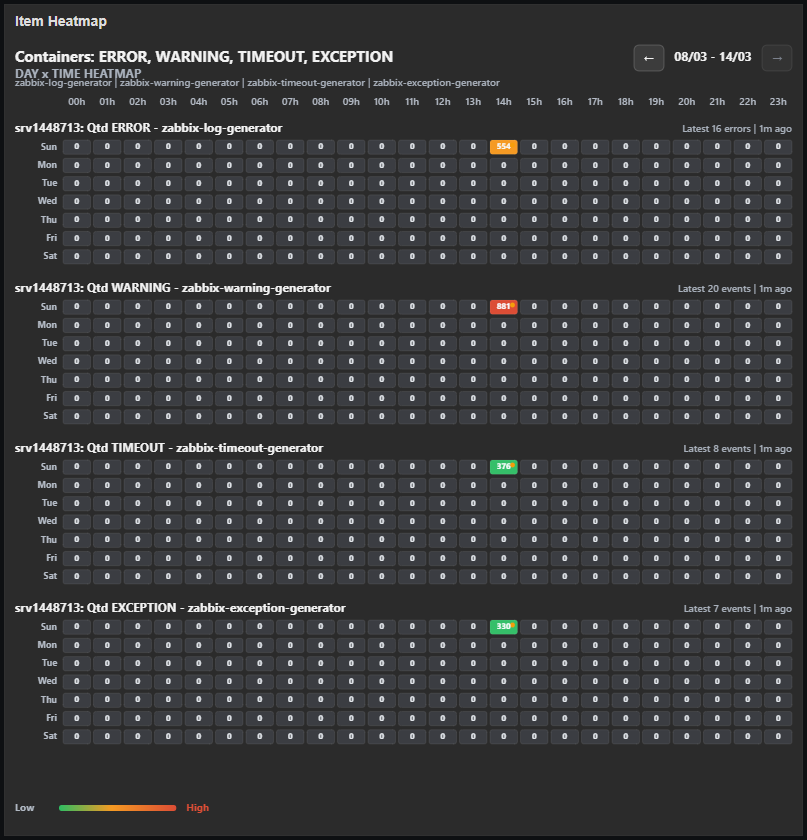
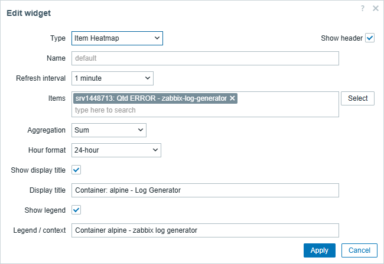
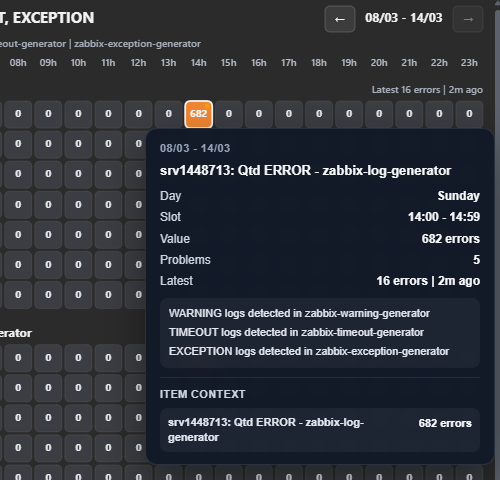
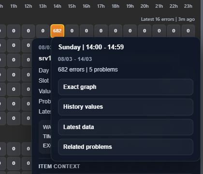
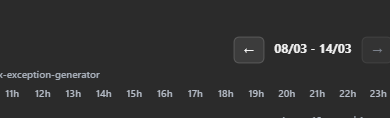
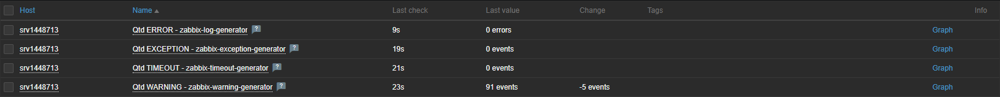

# Item Heatmap Widget for Zabbix

Item Heatmap is a custom widget for the Zabbix dashboard that turns numeric
item history into a weekly heatmap by day of week and hour. It is designed
for monitoring and observability teams that need to understand when activity
clusters, when specific services become noisy, and how recurring issues
evolve over time.

It works especially well with numeric metrics derived from Docker logs,
container errors, warnings, timeouts, and exceptions.



## Features

- Render one or more numeric Zabbix items as a weekly heatmap.
- Aggregate data by day of week and hour.
- Support `Sum`, `Average`, `Maximum`, and `Count non-zero`.
- Switch between a consolidated view and item-by-item comparison mode.
- Navigate week by week with on-demand loading.
- Show hover tooltips with bucket details, latest value, and item context.
- Open drill-down actions directly from a populated cell.
- Support 12-hour and 24-hour hour labels.
- Allow a custom internal title and optional legend/context line.
- Adapt the visual palette to the active Zabbix theme.

## Use Cases

- Identify recurring container errors during specific hours or weekdays.
- Compare multiple services or containers in the same dashboard widget.
- Transform raw Docker logs into operational counters and visualize them as a
  heatmap.
- Review incident patterns without leaving the Zabbix dashboard.
- Build lightweight visual monitoring for noisy workloads and background jobs.

## Installation

1. Copy the module directory into the Zabbix frontend modules directory.

   ```bash
   docker cp zabbix-item-heatmap-widget \
     zabbix-web:/usr/share/zabbix/modules/
   ```

   For non-Docker installations, copy the repository folder into the
   frontend modules directory used by your Zabbix deployment.

2. In the Zabbix UI, open:

   ```text
   Administration -> Modules
   ```

3. Click `Scan directory`.
4. Locate `Item Heatmap`.
5. Enable the module.

## Adding the Widget

1. Open the target dashboard.
2. Click `Edit dashboard`.
3. Add a new widget and choose `Item Heatmap`.
4. Select one or more numeric items.
5. Choose the aggregation mode, display mode, period window, granularity,
   and hour format.
6. Optionally define a display title and legend/context line.
7. Save the dashboard.

The current configuration supports multiple items, comparison mode, period
window, granularity, hour format, title, and legend.



## Interaction Model

The widget is built to move quickly from pattern recognition to
investigation.

### Hover Tooltip

On hover, the widget shows the week label, day, time bucket, aggregated
value, latest value, and item context for the selected cell.



### Drill-Down Actions

Clicking a populated cell opens drill-down actions that make investigation
practical inside Zabbix, such as graph access, history values, latest data,
and related problems.



### Weekly Navigation

The widget supports week-by-week navigation so you can move through history
without rebuilding the dashboard or loading every week upfront.



## Converting Logs into Numeric Metrics

One of the most practical workflows for this widget is converting raw Docker
logs into numeric counters and then visualizing those counters as a weekly
heatmap.

```text
container logs -> log item -> dependent numeric item -> heatmap
```

Typical examples include counting:

- `ERROR` occurrences per check
- `WARNING` occurrences per check
- timeout messages
- exception messages

Once the dependent items are producing numeric values, they can be selected
directly in the widget and compared side by side.

The screenshot below shows numeric items in `Latest data`, ready to feed the
heatmap.



## Project Structure

```text
zabbix-item-heatmap-widget
|-- actions/
|   |-- WidgetEdit.php
|   `-- WidgetView.php
|-- assets/
|   |-- css/
|   |   `-- widget.css
|   `-- js/
|       `-- class.widget.js
|-- docs/
|   |-- images/
|   `-- SCREENSHOTS.md
|-- includes/
|   |-- HeatmapDataProvider.php
|   `-- WidgetForm.php
|-- views/
|   |-- widget.edit.php
|   `-- widget.view.php
|-- manifest.json
|-- Module.php
|-- Widget.php
`-- README.md
```

## Compatibility

This repository targets modern Zabbix environments. The current project
state has been tested in a Zabbix 7.4.x environment.

If you plan to use it with another Zabbix version, validate the widget in
your own deployment before rolling it out broadly.

## Roadmap

- Expand compatibility validation across additional Zabbix 7.x releases.
- Improve bucket-level investigation and drill-down paths.
- Add more examples for numeric items derived from logs.
- Extend comparison scenarios for multi-item heatmap analysis.
- Publish more documented monitoring workflows and release notes.

## License

This project is licensed under the MIT License. See [LICENSE](LICENSE) for
details.
