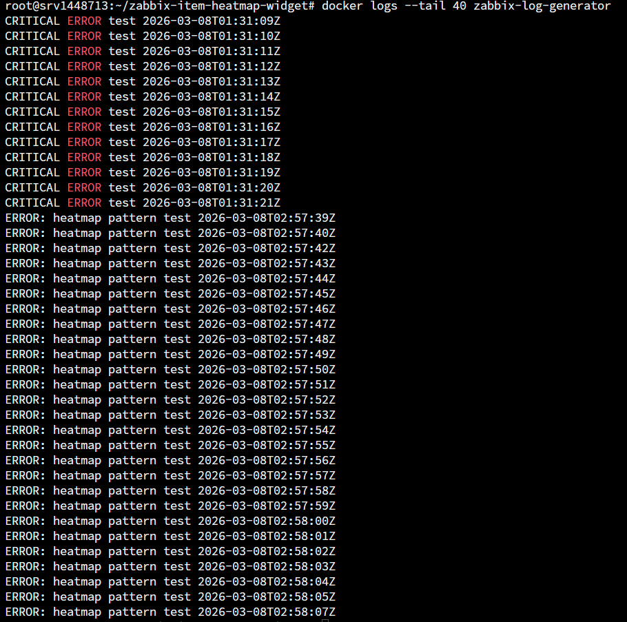
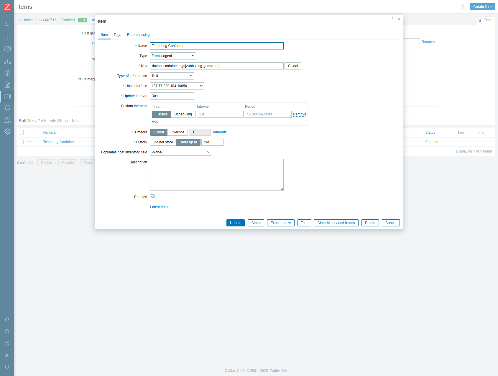
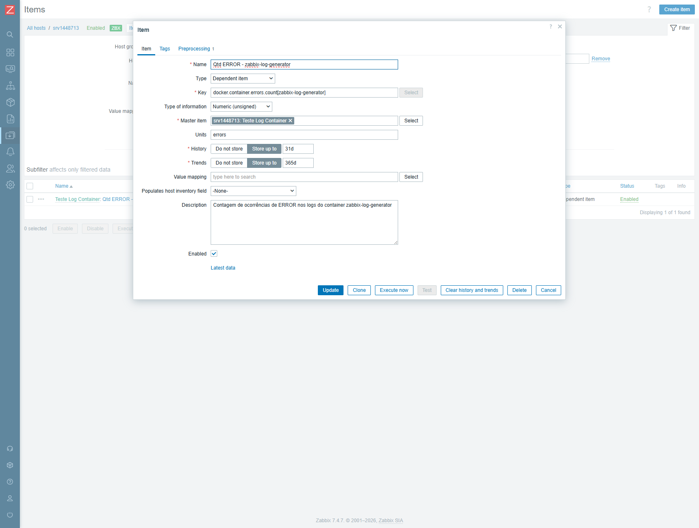
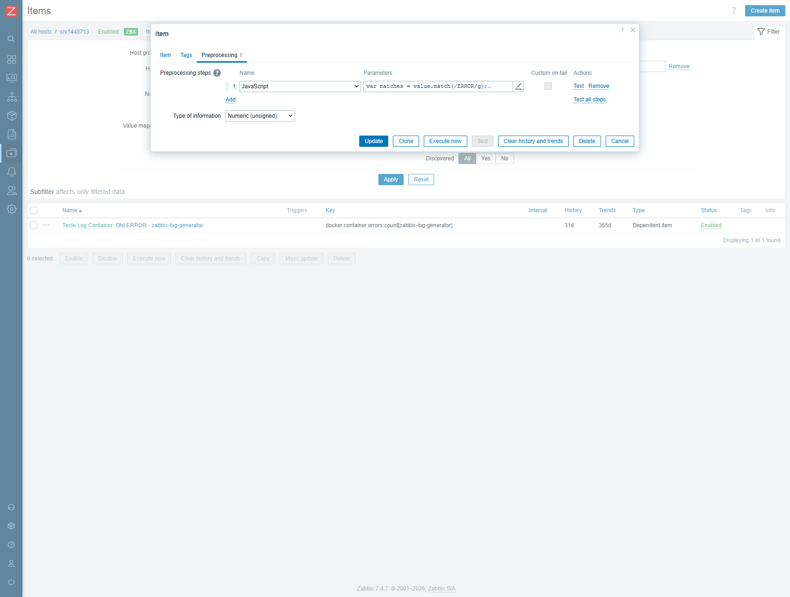

# Item Heatmap Widget for Zabbix

Item Heatmap is a custom Zabbix widget for the Zabbix dashboard that
turns numeric item history into a weekly heatmap by day of week and hour.
It helps monitoring and observability teams spot recurring patterns,
correlate noisy periods, and understand when activity clusters across the
week.


## Features

- Visualize one or more Zabbix items as a heatmap in a weekly layout.
- Aggregate values by day of week and hour to expose operational patterns.
- Support multiple aggregation modes, including sum, average, maximum, and
  count non-zero.
- Compare multiple items in the same widget or consolidate them into a
  single weekly heatmap.
- Navigate week by week with on-demand loading instead of preloading all
  history.
- Use hover tooltips and cell drill-down to move from pattern recognition to
  investigation.
- Fit naturally into a Zabbix dashboard without changing the widget's
  functional flow.
- Work well with numeric metrics derived from Docker logs and container
  errors.

## Use Cases

- Identify recurring application failures that cluster on specific weekdays
  or business hours.
- Visualize numeric item trends generated from Docker logs, such as error
  counters, retry counters, or timeout rates.
- Compare multiple services, queues, workers, or containers inside the same
  weekly heatmap view.
- Support incident reviews by showing when a problem started to become
  recurrent rather than only how often it occurred.
- Build a lightweight monitoring view for teams that need visual pattern
  recognition directly inside Zabbix.

## Installation

1. Copy the module directory into the Zabbix frontend modules directory.

   ```bash
   docker cp zabbix-item-heatmap-widget \
     zabbix-web:/usr/share/zabbix/modules/
   ```

   For non-Docker installations, copy the repository folder into the
   frontend modules directory used by your Zabbix deployment.

2. In the Zabbix UI, open:

   ```text
   Administration -> Modules
   ```

3. Click `Scan directory`.
4. Locate `Item Heatmap`.
5. Enable the module.

## Adding the Widget

1. Open the target Zabbix dashboard.
2. Click `Edit dashboard`.
3. Add a new widget and choose `Item Heatmap`.
4. Select one or more numeric items.
5. Choose the aggregation mode, display mode, period window, and
   granularity.
6. Optionally define an internal title and legend for the widget.
7. Save the dashboard.

The current widget configuration includes controls for multiple items,
aggregation, display mode, period window, granularity, hour format, title,
and legend.


## Converting Logs into Numeric Metrics

One of the most practical workflows for this project is turning Docker logs
into a numeric item and then rendering that item as a heatmap.

Flow:

```text
container logs -> log item -> dependent numeric item -> weekly heatmap
```

This pattern is especially useful for container errors, warnings, timeouts,
and exceptions that are easier to reason about as counters than as raw log
streams.

Start with the raw log source that captures the signal you want to count.



Create or reuse a log item that ingests the source logs in Zabbix.



Create a dependent item that converts those logs into a numeric item. This
dependent item becomes the data source used by the widget.



Add preprocessing logic to count the pattern you care about, such as
`ERROR`, `WARNING`, or `TIMEOUT`.

```javascript
var matches = value.match(/ERROR/g);
return matches ? matches.length : 0;
```



Validate that the dependent item is producing numeric values in `Latest
data` before adding it to the dashboard.


With that pipeline in place, the widget becomes a compact visual layer for
weekly monitoring, observability, and pattern analysis.

## Weekly Navigation

The widget supports week-by-week navigation so you can move backward and
forward through the available history without rebuilding the dashboard.
This is useful when comparing incident-heavy weeks with quieter periods or
when reviewing how a numeric item evolved over time.


## Project Structure

```text
zabbix-item-heatmap-widget
|-- actions/
|   |-- WidgetEdit.php
|   `-- WidgetView.php
|-- assets/
|   |-- css/
|   |   `-- widget.css
|   `-- js/
|       `-- class.widget.js
|-- docs/
|   |-- images/
|   `-- SCREENSHOTS.md
|-- includes/
|   |-- HeatmapDataProvider.php
|   `-- WidgetForm.php
|-- views/
|   |-- widget.edit.php
|   `-- widget.view.php
|-- manifest.json
|-- Module.php
|-- Widget.php
`-- README.md
```

## Compatibility

This repository is intended for modern Zabbix environments. The current
project state has been tested in a Zabbix 7.4.x environment.

If you plan to use it with another Zabbix version, validate the widget in
your own deployment before rolling it out broadly.

## Roadmap

- Expand compatibility validation across additional Zabbix 7.x releases.
- Improve drill-down options for bucket-level investigation.
- Add more documentation examples for numeric item pipelines based on logs.
- Broaden comparison scenarios for multi-item heatmap analysis.
- Publish release notes and examples for common monitoring workflows.

## License

This project is licensed under the MIT License. See [LICENSE](LICENSE) for
details.
