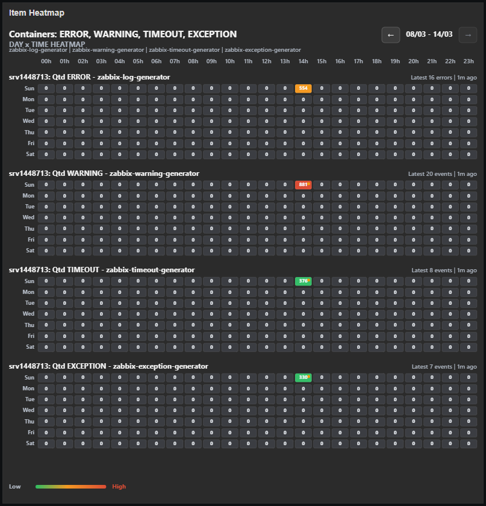
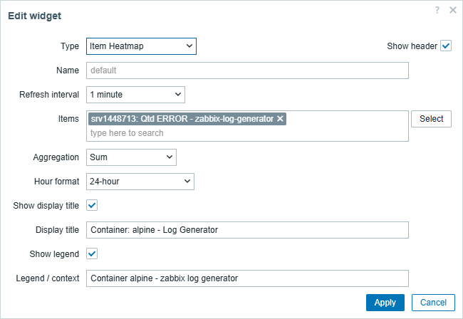
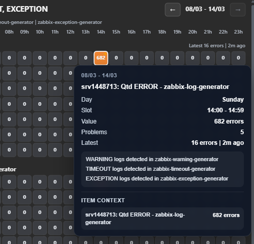
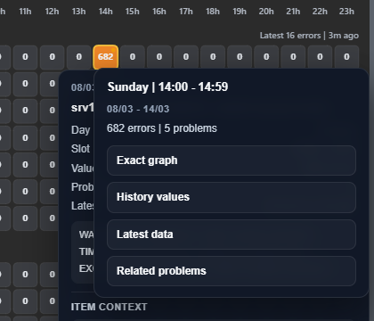
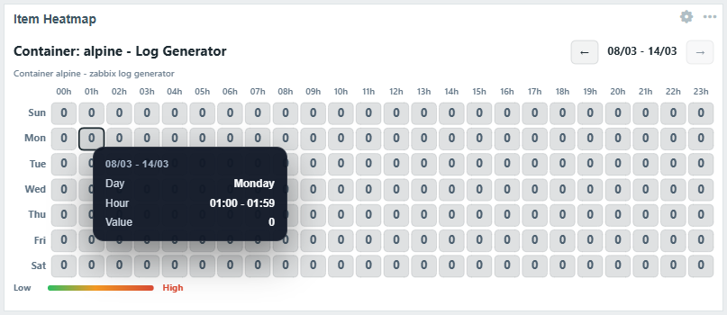
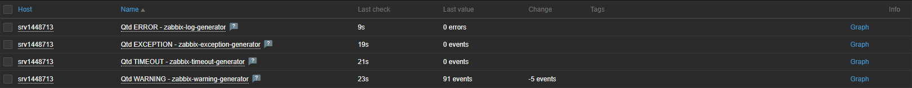

# Item Heatmap Widget for Zabbix

Item Heatmap is a custom widget for the Zabbix dashboard that turns numeric
item history into a weekly heatmap by day of week and hour. It is designed
for monitoring and observability teams that need to understand when activity
clusters, when specific services become noisy, and how recurring issues
evolve over time.

It works especially well with numeric metrics derived from Docker logs,
container errors, warnings, timeouts, and exceptions.



## Features

- Render one or more numeric Zabbix items as a weekly heatmap.
- Aggregate data by day of week and hour.
- Support `Sum`, `Average`, `Maximum`, and `Count non-zero`.
- Switch between a consolidated view and item-by-item comparison mode.
- Navigate week by week with on-demand loading.
- Show hover tooltips with bucket details, latest value, and item context.
- Open drill-down actions directly from a populated cell.
- Associate one log or text item with the heatmap for bucket-level log review.
- Open the associated log history using the exact start and end time of the
  clicked heatmap cell.
- Choose automatic color scaling or define operational low/high thresholds.
- Show the configured threshold values directly in the heatmap legend.
- Support 12-hour and 24-hour time labels.
- Allow a custom internal title and optional legend/context line.
- Adapt the visual palette to the active Zabbix theme.

## Use Cases

- Identify recurring container errors during specific hours or weekdays.
- Compare multiple services or containers in the same dashboard widget.
- Transform raw Docker logs into operational counters and visualize them as a
  heatmap.
- Use a numeric counter to locate noisy periods and then open the original logs
  for the same time bucket.
- Apply stable severity colors that do not change when a weekly maximum changes.
- Review incident patterns without leaving the Zabbix investigation workflow.
- Build lightweight visual monitoring for noisy workloads and background jobs.

## Installation

1. Copy the module directory into the Zabbix frontend modules directory.

   ```bash
   docker cp zabbix-item-heatmap-widget \
     zabbix-web:/usr/share/zabbix/modules/
   ```

   For non-Docker installations, copy the repository folder into the
   frontend modules directory used by your Zabbix deployment.

2. In the Zabbix UI, open:

   ```text
   Administration -> Modules
   ```

3. Click `Scan directory`.
4. Locate `Item Heatmap`.
5. Enable the module.

## Adding the Widget

1. Open the target dashboard.
2. Click `Edit dashboard`.
3. Add a new widget and choose `Item Heatmap`.
4. Select one or more numeric items.
5. Optionally select exactly one item in `Associated log item`.
6. Choose the aggregation mode, display mode, period window, granularity,
   and hour format.
7. Choose `Automatic` or `Manual thresholds` in `Color scale`.
8. For manual mode, define `Low threshold` and `High threshold`.
9. Optionally define a display title and legend/context line.
10. Save the dashboard.

The associated log item is optional. When exactly one valid item is selected,
the populated-cell menu includes an `Error logs` action. If no item or more
than one distinct item is configured, the log drill-down is disabled.

The current configuration supports multiple numeric items, comparison mode,
period window, granularity, hour format, color thresholds, title, legend, and
one associated log item.



## Color Scale

The widget supports two color-scale modes.

### Automatic

Automatic mode keeps the original behavior. Cell intensity is calculated
relative to the highest value in the displayed week. This mode is useful for
exploratory dashboards where relative activity matters more than fixed
operational limits.

### Manual thresholds

Manual mode uses fixed low and high limits configured per widget.

```text
0                     -> inactive / neutral cell
1 through low         -> low color
between low and high  -> graduated warning colors
high or greater       -> high color
```

For an Asterisk error counter, an initial configuration could be:

```text
Low threshold: 3
High threshold: 10
```

With this configuration, a value of `10`, `23`, or `100` remains in the high
severity color. The scale no longer changes just because a larger weekly value
appears. The legend displays the effective low and high thresholds so dashboard
viewers can interpret the colors without opening the widget settings.

## Interaction Model

The widget is built to move quickly from pattern recognition to
investigation.

### Hover Tooltip

On hover, the widget shows the week label, day, time bucket, aggregated
value, latest value, and item context for the selected cell.



### Drill-Down Actions

Clicking a populated cell opens drill-down actions that make investigation
practical inside Zabbix, such as graph access, history values, latest data,
related problems, and the associated error logs.

The `Error logs` action opens the configured log item's value history using
the exact time interval represented by the clicked cell. For example, clicking
a one-hour cell for `10:00` opens log values from `10:00:00` through
`10:59:59`.



### Weekly Navigation

The widget supports week-by-week navigation so you can move through history
without rebuilding the dashboard or loading every week upfront.



## Converting Logs into Numeric Metrics

One of the most practical workflows for this widget is storing both a numeric
counter and the original log message in Zabbix.

```text
container logs -> numeric counter item -> heatmap
               -> log/text item       -> associated log drill-down
```

Typical examples include counting:

- `ERROR` occurrences per check
- `WARNING` occurrences per check
- timeout messages
- exception messages
- Asterisk peer `UNREACHABLE` events

Example configuration:

```text
Heatmap item:
asterisk.errors.total

Associated log item:
asterisk.errors.log
```

The numeric item receives values such as `1` for each detected event. The log
item stores the original message, including timestamps, modules, extensions,
peers, or other context needed during investigation.

Once the numeric items are producing values, they can be selected directly in
the widget and compared side by side. The associated log item can then be used
to inspect the original messages for a populated bucket.

The screenshot below shows numeric items in `Latest data`, ready to feed the
heatmap.



## Project Structure

```text
zabbix-item-heatmap-widget
|-- actions/
|   |-- WidgetEdit.php
|   `-- WidgetView.php
|-- assets/
|   |-- css/
|   |   `-- widget.css
|   `-- js/
|       |-- class.widget.js
|       |-- color-scale.js
|       `-- log-drilldown.js
|-- docs/
|   |-- images/
|   `-- SCREENSHOTS.md
|-- includes/
|   |-- HeatmapDataProvider.php
|   `-- WidgetForm.php
|-- views/
|   |-- widget.edit.php
|   `-- widget.view.php
|-- manifest.json
|-- Module.php
|-- Widget.php
`-- README.md
```

## Compatibility

This repository targets modern Zabbix environments. The core widget has been
tested in Zabbix 7.4.x, and the counter plus associated-log workflow has also
been validated in a Zabbix 7.0.x environment.

If you plan to use it with another Zabbix version, validate the widget in your
own deployment before rolling it out broadly.

## Release 1.2.0

Version `1.2.0` adds configurable color scaling. Operators can keep the
relative automatic scale or define fixed low and high thresholds for stable
operational severity colors. The legend now exposes the configured threshold
values when manual mode is active.

## Release 1.1.0

Version `1.1.0` adds optional associated-log drill-down. A heatmap cell can now
open the original log or text item values for the exact bucket interval while
preserving all existing graph, primary-item history, latest-data, and related-
problem actions.

## Roadmap

- Expand compatibility validation across additional Zabbix 7.x releases.
- Improve bucket-level investigation with an optional in-dashboard log modal.
- Add more examples for numeric items derived from logs.
- Extend comparison scenarios for multi-item heatmap analysis.
- Publish more documented monitoring workflows and release notes.

## License

This project is licensed under the MIT License. See [LICENSE](LICENSE) for
details.
